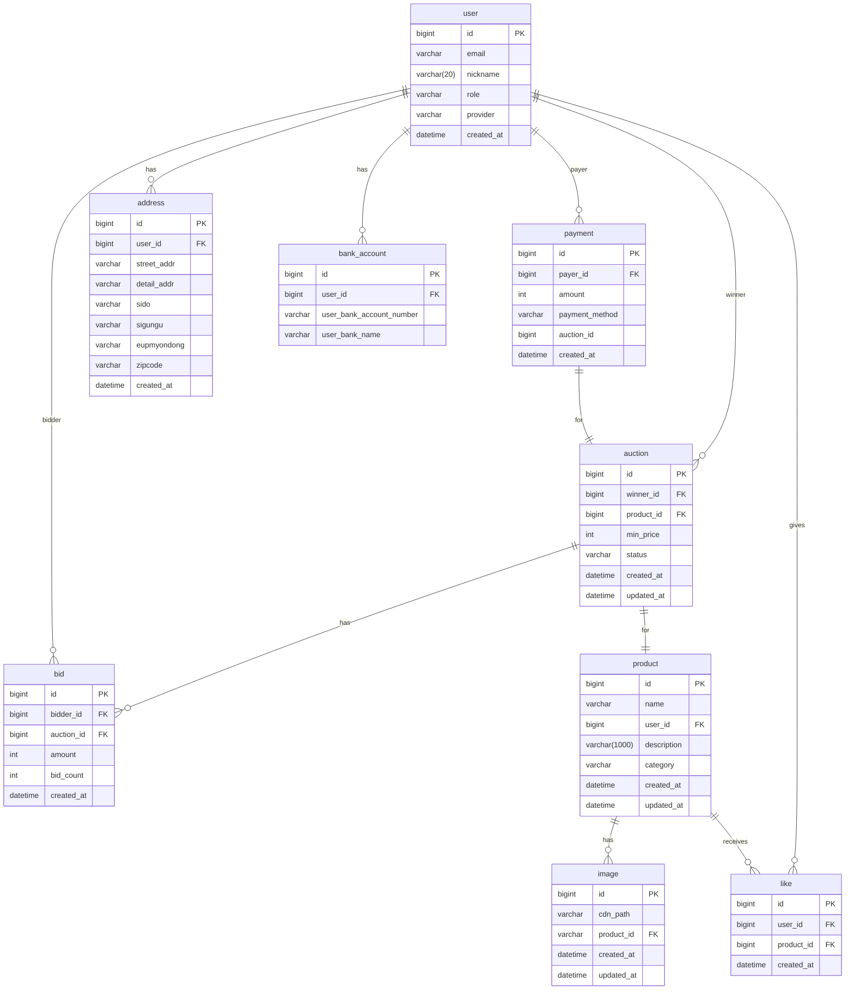

<div align="center" >

# 치즈마켓 🧀️

<b>실시간 경매로 즐기는 중고거래 플랫폼</b>


<h3> "여러분의 물건에 새로운 가치를 불어넣어보세요" </h3>

실시간 경매 기반 중고거래 플랫폼

<br />

잠자고 있는 여러분의 물건에 새 주인을 찾아주세요.

흥미진진한 실시간 경매를 통해 공정한 가격을 만들어갑니다.

누구나 판매자가 되고, 구매자가 되는 즐거운 거래의 장.

여러분의 소중한 물건이 새로운 이야기를 만들어갑니다. 🛍️💰

</br>

[✨ <치즈마켓> 사용해보기](https://www.xn--910b8hh6hdsz.com/)

[🔗 Notion 바로가기](https://www.notion.so/b5153d7acbcc407b8c58e2efcd527dca?pvs=4)

<br>

[](https://hits.seeyoufarm.com)

</div>

<br>

## 🌼 프로젝트 소개

> 개발 기간: 24.06.11 ~ 진행중

치즈마켓은 실시간 경매 기반의 중고거래 플랫폼입니다. 백엔드 개발에서는 다음과 같은 주요 기능을 구현했습니다

> 추가적인 상세 설명 화면 소개 등 필요

* 사용자 인증 및 권한 관리 (OAuth2.0 기반)
* 실시간 경매 시스템
* 상품 등록 및 관리 API
* 결제 시스템 연동 (토스페이먼츠 API 활용)
* 알림 서비스 (SSE를 이용한 실시간 알림)
* 이미지 업로드 및 CDN 연동 (AWS S3, CloudFront 활용)
* 검색 기능 및 카테고리 관리
* 사용자 프로필 및 거래 내역 관리

<br>

## 📖 기술 스택

<table>
    <thead>
        <tr>
            <th>분류</th>
            <th>기술 스택</th>
        </tr>
    </thead>
    <tbody>
        <tr>
            <td>
                  <p>프론트엔드</p>
            </td>
            <td>
                
                
            </td>
        </tr>
        <tr>
            <td>
                <p>백엔드</p>
            </td>
            <td>
                 
                
                
                
            </td>
        </tr>
                <tr>
            <td>
                <p>데이터베이스</p>
            </td>
            <td>
                
                
                
            </td>
        </tr>
                <tr>
            <td>
                <p>인프라</p>
            </td>
            <td>
                
                
                
                
                
            </td>
        </tr>
        <tr>
            <td>
                <p>테스팅</p>
            </td>
            <td>
                
                
                
            </td>
        </tr>
        <tr>
            <td>
                <p>모니터링</p>
            </td>
            <td>
                
                
                
            </td>
        </tr>
        <tr>
            <td>
                <p>기타</p>
            </td>
            <td>
                
                
                
                
            </td>
        </tr>
        <tr>
            <td>
                <p>협업</p>
            </td>
            <td>
                
                
                
                
                
                
            </td>
        </tr>
    </tbody>
</table>

<br>

## ⚙️ 시스템 아키텍처


<br>

## 🛢️ ERD




<br>

## 🛎️ 주요 API 엔드포인트 (v1.0.0)

> Swagger UI: https://app.swaggerhub.com/apis-docs/CHLWNDKS333_1/chzz-market-api/1.0.0#/Products

### Users API

| Method | Endpoint                         | Description      | Auth Required |
|--------|----------------------------------|------------------|:-------------:|
| GET    | /users                           | 사용자 프로필 조회       |       ✅       |
| POST   | /users                           | 회원가입             |       ✅       |
| POST   | /users/profile                   | 내 프로필 수정         |       ✅       |
| POST   | /users/tokens/reissue            | 토큰 재발급           |               |
| POST   | /users/logout                    | 로그아웃             |               |
| GET    | /users/customer-key              | 내 customerKey 조회 |       ✅       |
| GET    | /users/{nickname}                | 특정 사용자 프로필 조회    |               |
| GET    | /users/check/nickname/{nickname} | 닉네임 중복 확인        |               |

### Products API

| Method | Endpoint                    | Description       | Auth Required |
|--------|-----------------------------|-------------------|:-------------:|
| PATCH  | /products/{productId}       | 사전 등록 상품 수정       |       ✅       |
| DELETE | /products/{productId}       | 사전 등록 상품 삭제       |       ✅       |
| GET    | /products/{productId}       | 사전 등록 상품 상세 정보 조회 |       ✅       |
| POST   | /products/{productId}/likes | 상품 좋아요 토글         |       ✅       |
| GET    | /products                   | 사전 등록 상품 목록 조회    |       ✅       |
| GET    | /products/categories        | 상품 카테고리 목록 조회     |               |
| GET    | /products/users/{nickname}  | 나의 사전 등록 상품 목록 조회 |               |
| GET    | /products/history           | 내가 참여한 사전경매 조회    |       ✅       |

### Auctions API

| Method | Endpoint                   | Description          | Auth Required |
|--------|----------------------------|----------------------|:-------------:|
| POST   | /auctions                  | 경매 등록                |       ✅       |
| GET    | /auctions                  | 경매 목록 조회             |       ✅       |
| POST   | /auctions/start            | 경매 상품으로 전환           |       ✅       |
| GET    | /auctions/{auctionId}      | 경매 상세 조회             |       ✅       |
| GET    | /auctions/history          | 경매 입찰 내역 조회          |       ✅       |
| GET    | /auctions/won              | 내가 성공한 경매 조회         |       ✅       |
| GET    | /auctions/lost             | 내가 실패한 경매 조회         |       ✅       |
| GET    | /auctions/users/{nickname} | 사용자 경매 상품 목록 조회      |               |
| GET    | /auctions/best             | Best 경매 상품 목록 조회     |               |
| GET    | /auctions/imminent         | Imminent 경매 상품 목록 조회 |               |
| GET    | /auctions/{auctionId}/bids | 경매 입찰 목록 조회          |       ✅       |

### Bids API

| Method | Endpoint             | Description | Auth Required |
|--------|----------------------|-------------|:-------------:|
| GET    | /bids                | 입찰 내역 조회    |       ✅       |
| POST   | /bids                | 입찰 요청 및 수정  |       ✅       |
| PATCH  | /bids/{bidId}/cancel | 입찰 취소       |       ✅       |

### Payment API

| Method | Endpoint           | Description | Auth Required |
|--------|--------------------|-------------|:-------------:|
| POST   | /payments/approval | 결제 승인       |       ✅       |
| POST   | /payments/order-id | 결제 주문 ID 생성 |               |

### Addresses API

| Method | Endpoint   | Description | Auth Required |
|--------|------------|-------------|:-------------:|
| POST   | /addresses | 주소 등록       |       ✅       |
| GET    | /addresses | 주소 목록 조회    |       ✅       |

### Notifications API

| Method | Endpoint                             | Description | Produces          | Auth Required |
|--------|--------------------------------------|-------------|-------------------|:-------------:|
| GET    | /notifications                       | 알림 목록 조회    | application/json  |       ✅       |
| GET    | /notifications/subscribe             | 실시간 알림 구독   | text/event-stream |       ✅       |
| POST   | /notifications/{notificationId}/read | 알림 읽음 처리    | application/json  |       ✅       |
| DELETE | /notifications/{notificationId}      | 알림 삭제       | application/json  |       ✅       |

<br>

## 🚗 배포 전략

> 추후 추가

<br>

## 🌲 프로젝트 구조

```
📦src
 ┣ 📂main
 ┃ ┣ 📂java
 ┃ ┃ ┗ 📂org
 ┃ ┃ ┃ ┗ 📂chzz
 ┃ ┃ ┃ ┃ ┗ 📂market
 ┃ ┃ ┃ ┃ ┃ ┣ 📂common
 ┃ ┃ ┃ ┃ ┃ ┃ ┣ 📂config
 ┃ ┃ ┃ ┃ ┃ ┃ ┃ ┣ 📂logging
 ┃ ┃ ┃ ┃ ┃ ┃ ┣ 📂dto
 ┃ ┃ ┃ ┃ ┃ ┃ ┣ 📂error
 ┃ ┃ ┃ ┃ ┃ ┃ ┃ ┣ 📂exception
 ┃ ┃ ┃ ┃ ┃ ┃ ┃ ┣ 📂handler
 ┃ ┃ ┃ ┃ ┃ ┃ ┣ 📂filter
 ┃ ┃ ┃ ┃ ┃ ┃ ┣ 📂quartz
 ┃ ┃ ┃ ┃ ┃ ┃ ┣ 📂util
 ┃ ┃ ┃ ┃ ┃ ┃ ┗ 📂validation
 ┃ ┃ ┃ ┃ ┃ ┃ ┃ ┣ 📂annotation
 ┃ ┃ ┃ ┃ ┃ ┃ ┃ ┗ 📂validator
 ┃ ┃ ┃ ┃ ┃ ┣ 📂domain
 ┃ ┃ ┃ ┃ ┃ ┃ ┣ 📂address
 ┃ ┃ ┃ ┃ ┃ ┃ ┃ ┣ 📂controller
 ┃ ┃ ┃ ┃ ┃ ┃ ┃ ┣ 📂dto
 ┃ ┃ ┃ ┃ ┃ ┃ ┃ ┃ ┗ 📂request
 ┃ ┃ ┃ ┃ ┃ ┃ ┃ ┣ 📂entity
 ┃ ┃ ┃ ┃ ┃ ┃ ┃ ┣ 📂repository
 ┃ ┃ ┃ ┃ ┃ ┃ ┃ ┗ 📂service
 ┃ ┃ ┃ ┃ ┃ ┃ ┣ 📂auction
 ┃ ┃ ┃ ┃ ┃ ┃ ┃ ┣ 📂controller
 ┃ ┃ ┃ ┃ ┃ ┃ ┃ ┣ 📂dto
 ┃ ┃ ┃ ┃ ┃ ┃ ┃ ┃ ┣ 📂request
 ┃ ┃ ┃ ┃ ┃ ┃ ┃ ┃ ┣ 📂response
 ┃ ┃ ┃ ┃ ┃ ┃ ┃ ┣ 📂entity
 ┃ ┃ ┃ ┃ ┃ ┃ ┃ ┃ ┣ 📂listener
 ┃ ┃ ┃ ┃ ┃ ┃ ┃ ┣ 📂error
 ┃ ┃ ┃ ┃ ┃ ┃ ┃ ┣ 📂repository
 ┃ ┃ ┃ ┃ ┃ ┃ ┃ ┣ 📂schedule
 ┃ ┃ ┃ ┃ ┃ ┃ ┃ ┣ 📂service
 ┃ ┃ ┃ ┃ ┃ ┃ ┃ ┃ ┣ 📂register
 ┃ ┃ ┃ ┃ ┃ ┃ ┃ ┗ 📂type
 ┃ ┃ ┃ ┃ ┃ ┃ ┣ 📂bank_account
 ┃ ┃ ┃ ┃ ┃ ┃ ┃ ┗ 📂entity
 ┃ ┃ ┃ ┃ ┃ ┃ ┣ 📂base
 ┃ ┃ ┃ ┃ ┃ ┃ ┃ ┗ 📂entity
 ┃ ┃ ┃ ┃ ┃ ┃ ┣ 📂bid
 ┃ ┃ ┃ ┃ ┃ ┃ ┃ ┣ 📂controller
 ┃ ┃ ┃ ┃ ┃ ┃ ┃ ┣ 📂dto
 ┃ ┃ ┃ ┃ ┃ ┃ ┃ ┃ ┣ 📂query
 ┃ ┃ ┃ ┃ ┃ ┃ ┃ ┃ ┣ 📂response
 ┃ ┃ ┃ ┃ ┃ ┃ ┃ ┣ 📂entity
 ┃ ┃ ┃ ┃ ┃ ┃ ┃ ┣ 📂error
 ┃ ┃ ┃ ┃ ┃ ┃ ┃ ┣ 📂repository
 ┃ ┃ ┃ ┃ ┃ ┃ ┃ ┗ 📂service
 ┃ ┃ ┃ ┃ ┃ ┃ ┣ 📂image
 ┃ ┃ ┃ ┃ ┃ ┃ ┃ ┣ 📂dto
 ┃ ┃ ┃ ┃ ┃ ┃ ┃ ┣ 📂entity
 ┃ ┃ ┃ ┃ ┃ ┃ ┃ ┣ 📂error
 ┃ ┃ ┃ ┃ ┃ ┃ ┃ ┣ 📂repository
 ┃ ┃ ┃ ┃ ┃ ┃ ┃ ┗ 📂service
 ┃ ┃ ┃ ┃ ┃ ┃ ┣ 📂like
 ┃ ┃ ┃ ┃ ┃ ┃ ┃ ┣ 📂dto
 ┃ ┃ ┃ ┃ ┃ ┃ ┃ ┣ 📂entity
 ┃ ┃ ┃ ┃ ┃ ┃ ┃ ┣ 📂error
 ┃ ┃ ┃ ┃ ┃ ┃ ┃ ┣ 📂repository
 ┃ ┃ ┃ ┃ ┃ ┃ ┃ ┗ 📂service
 ┃ ┃ ┃ ┃ ┃ ┃ ┣ 📂notification
 ┃ ┃ ┃ ┃ ┃ ┃ ┃ ┣ 📂controller
 ┃ ┃ ┃ ┃ ┃ ┃ ┃ ┣ 📂dto
 ┃ ┃ ┃ ┃ ┃ ┃ ┃ ┃ ┣ 📂response
 ┃ ┃ ┃ ┃ ┃ ┃ ┃ ┣ 📂entity
 ┃ ┃ ┃ ┃ ┃ ┃ ┃ ┣ 📂error
 ┃ ┃ ┃ ┃ ┃ ┃ ┃ ┣ 📂event
 ┃ ┃ ┃ ┃ ┃ ┃ ┃ ┣ 📂repository
 ┃ ┃ ┃ ┃ ┃ ┃ ┃ ┗ 📂service
 ┃ ┃ ┃ ┃ ┃ ┃ ┣ 📂payment
 ┃ ┃ ┃ ┃ ┃ ┃ ┃ ┣ 📂controller
 ┃ ┃ ┃ ┃ ┃ ┃ ┃ ┣ 📂dto
 ┃ ┃ ┃ ┃ ┃ ┃ ┃ ┃ ┣ 📂request
 ┃ ┃ ┃ ┃ ┃ ┃ ┃ ┃ ┗ 📂response
 ┃ ┃ ┃ ┃ ┃ ┃ ┃ ┣ 📂entity
 ┃ ┃ ┃ ┃ ┃ ┃ ┃ ┣ 📂error
 ┃ ┃ ┃ ┃ ┃ ┃ ┃ ┣ 📂repository
 ┃ ┃ ┃ ┃ ┃ ┃ ┃ ┗ 📂service
 ┃ ┃ ┃ ┃ ┃ ┃ ┣ 📂product
 ┃ ┃ ┃ ┃ ┃ ┃ ┃ ┣ 📂controller
 ┃ ┃ ┃ ┃ ┃ ┃ ┃ ┣ 📂dto
 ┃ ┃ ┃ ┃ ┃ ┃ ┃ ┣ 📂entity
 ┃ ┃ ┃ ┃ ┃ ┃ ┃ ┣ 📂error
 ┃ ┃ ┃ ┃ ┃ ┃ ┃ ┣ 📂repository
 ┃ ┃ ┃ ┃ ┃ ┃ ┃ ┗ 📂service
 ┃ ┃ ┃ ┃ ┃ ┃ ┣ 📂token
 ┃ ┃ ┃ ┃ ┃ ┃ ┃ ┣ 📂dto
 ┃ ┃ ┃ ┃ ┃ ┃ ┃ ┣ 📂entity
 ┃ ┃ ┃ ┃ ┃ ┃ ┃ ┣ 📂error
 ┃ ┃ ┃ ┃ ┃ ┃ ┃ ┣ 📂repository
 ┃ ┃ ┃ ┃ ┃ ┃ ┃ ┗ 📂service
 ┃ ┃ ┃ ┃ ┃ ┃ ┗ 📂user
 ┃ ┃ ┃ ┃ ┃ ┃ ┃ ┣ 📂controller
 ┃ ┃ ┃ ┃ ┃ ┃ ┃ ┣ 📂dto
 ┃ ┃ ┃ ┃ ┃ ┃ ┃ ┃ ┣ 📂request
 ┃ ┃ ┃ ┃ ┃ ┃ ┃ ┃ ┣ 📂response
 ┃ ┃ ┃ ┃ ┃ ┃ ┃ ┣ 📂entity
 ┃ ┃ ┃ ┃ ┃ ┃ ┃ ┣ 📂error
 ┃ ┃ ┃ ┃ ┃ ┃ ┃ ┣ 📂oauth2
 ┃ ┃ ┃ ┃ ┃ ┃ ┃ ┣ 📂repository
 ┃ ┃ ┃ ┃ ┃ ┃ ┃ ┗ 📂service
 ┃ ┃ ┃ ┃ ┃ ┗ 📜MarketApplication.java
 ┃ ┗ 📂resources
 ┃ ┃ ┣ 📂db
 ┃ ┃ ┃ ┣ 📂migration
 ┃ ┃ ┃ ┃ ┣ 📜V1__init.sql
 ┃ ┃ ┃ ┃ ┣ 📜V2__update_default_count_value.sql
 ┃ ┃ ┃ ┃ ┣ 📜V3__reorder_columns.sql
 ┃ ┃ ┃ ┃ ┗ 📜V4__add_profile_image_url_to_users.sql
 ┃ ┃ ┃ ┣ 📜data.sql
 ┃ ┃ ┃ ┗ 📜quartz-create.sql
 ┃ ┃ ┣ 📜application-test.yml
 ┃ ┃ ┗ 📜application.yml
 ┗ 📂test
 ┃ ┗ 📂java
 ┃ ┃ ┗ 📂org
 ┃ ┃ ┃ ┗ 📂chzz
 ┃ ┃ ┃ ┃ ┗ 📂market
 ┃ ┃ ┃ ┃ ┃ ┣ 📂common
 ┃ ┃ ┃ ┃ ┃ ┣ 📂domain
 ┃ ┃ ┃ ┃ ┃ ┃ ┣ 📂auction
 ┃ ┃ ┃ ┃ ┃ ┃ ┃ ┣ 📂controller
 ┃ ┃ ┃ ┃ ┃ ┃ ┃ ┣ 📂repository
 ┃ ┃ ┃ ┃ ┃ ┃ ┃ ┗ 📂service
 ┃ ┃ ┃ ┃ ┃ ┃ ┣ 📂bid
 ┃ ┃ ┃ ┃ ┃ ┃ ┃ ┣ 📂repository
 ┃ ┃ ┃ ┃ ┃ ┃ ┃ ┗ 📂service
 ┃ ┃ ┃ ┃ ┃ ┃ ┣ 📂like
 ┃ ┃ ┃ ┃ ┃ ┃ ┃ ┗ 📂service
 ┃ ┃ ┃ ┃ ┃ ┃ ┣ 📂notification
 ┃ ┃ ┃ ┃ ┃ ┃ ┃ ┣ 📂repository
 ┃ ┃ ┃ ┃ ┃ ┃ ┃ ┗ 📂service
 ┃ ┃ ┃ ┃ ┃ ┃ ┣ 📂product
 ┃ ┃ ┃ ┃ ┃ ┃ ┃ ┣ 📂repository
 ┃ ┃ ┃ ┃ ┃ ┃ ┃ ┗ 📂service
 ┃ ┃ ┃ ┃ ┃ ┃ ┣ 📂token
 ┃ ┃ ┃ ┃ ┃ ┃ ┃ ┗ 📂service
 ┃ ┃ ┃ ┃ ┃ ┃ ┗ 📂user
 ┃ ┃ ┃ ┃ ┃ ┃ ┃ ┣ 📂oauth2
 ┃ ┃ ┃ ┃ ┃ ┃ ┃ ┗ 📂service
 ┃ ┃ ┃ ┃ ┃ ┣ 📂util
 ┃ ┃ ┃ ┃ ┃ ┗ 📜MarketApplicationTests.java
```

## 👨‍👩‍👧‍👦 팀원 소개

<table >
  <tr height="30px">
    <td align="center" width="160px">
      <b>Backend</b>
    </td>
    <td align="center" width="160px">
      <b>Backend</b>
    </td>
    <td align="center" width="160px">
      <b>Backend</b>
    </td>
  </tr>
  <tr height="120px">
    <td align="center" width="160px">
      <a href="https://github.com/viaunixue"></a>
    </td>
    <td align="center" width="160px">
      <a href="https://github.com/junest66"></a>
    </td>
    <td align="center" width="160px">
      <a href="https://github.com/YeaChan05"></a>
    </td>
  </tr>
  <tr height="30px">
    <td align="center" width="160px">
      <a href="https://github.com/viaunixue">정종현</a>
    </td>
    <td align="center" width="160px">
      <a href="https://github.com/keem-hyun">최준</a>
    </td>
    <td align="center" width="160px">
      <a href="https://github.com/swwho96">신예찬</a>
    </td>
  </tr>
</table>

<br>